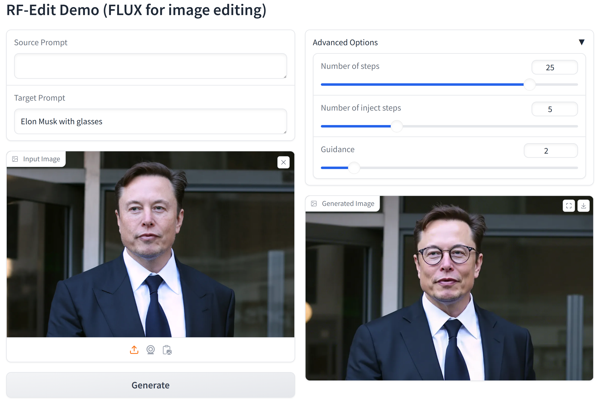

<div align="center">
  
# 🖼️ Image Editing Using FLUX

</div>


# 🛠️ Code Setup
The environment of our code is the same as FLUX, you can refer to the [official repo](https://github.com/black-forest-labs/flux/tree/main) of FLUX, or running the following command to construct the environment.
```
conda create --name RF-Solver-ImageEdit python=3.10
conda activate RF-Solver-ImageEdit
pip install -e ".[all]"
```
# 🚀 Examples for Image Editing
We have provided several scripts to reproduce the results in the paper, mainly including 3 types of editing: Stylization, Adding, Replacing. We suggest to run the experiment on a single A100 GPU.

## Stylization
<table class="center">
<tr>
  <td width=10% align="center">Ref Style</td>
  <td width=30% align="center"></td>
	<td width=30% align="center"></td>
  <td width=30% align="center"></td>
</tr>
<tr>
  <td width="10%" align="center">Editing Scripts</td>
  <td width="30%" align="center"><a href="src/run_nobel_trump.sh">Trump</a></td>
  <td width="30%" align="center"><a href="src/run_art_mari.sh"> Marilyn Monroe</a></td>
  <td width="30%" align="center"><a href="src/run_cartoon_ein.sh">Einstein</a></td>
</tr>
<tr>
  <td width=10% align="center">Edtied image</td>
  <td width=30% align="center"></td>
	<td width=30% align="center"></td>
  <td width=30% align="center"></td>
</tr>

<tr>
  <td width="10%" align="center">Editing Scripts</td>
  <td width="30%" align="center"><a href="src/run_nobel_biden.sh">Biden</a></td>
  <td width="30%" align="center"><a href="src/run_art_batman.sh">Batman</a></td>
  <td width="30%" align="center"><a href="src/run_cartoon_herry.sh">Herry Potter</a></td>
</tr>
<tr>
  <td width=10% align="center">Edtied image</td>
  <td width=30% align="center"></td>
	<td width=30% align="center"></td>
  <td width=30% align="center"></td>
</tr>
</table>

## Adding & Replacing
<table class="center">
<tr>
  <td width=10% align="center">Source image</td>
  <td width=30% align="center"></td>
	<td width=30% align="center"></td>
  <td width=30% align="center"></td>
</tr>
<tr>
  <td width="10%" align="center">Editing Scripts</td>
  <td width="30%" align="center"><a href="src/run_hiking.sh">+ hiking stick</a></td>
  <td width="30%" align="center"><a href="src/run_horse.sh">horse -> camel</a></td>
  <td width="30%" align="center"><a href="src/run_boy.sh">+ dog</a></td>
</tr>
<tr>
  <td width=10% align="center">Edtied image</td>
  <td width=30% align="center"></td>
	<td width=30% align="center"></td>
  <td width=30% align="center"></td>
</tr>

</table>


# 🪄 Edit Your Own Image

## Gradio Demo
We provide the gradio demo for image editing, which is also available on our 🤗 [Huggingface Space](https://huggingface.co/spaces/wjs0725/RF-Solver-Edit)! You can also run the gradio demo on your own device using the following command: 
```
cd src
python gradio_demo.py
```
Here is an example of using the gradio demo to edit an image! Note that here "Number of inject steps" means the steps of feature sharing in RF-Edit, which is highly related to the quality of edited results. We suggest tuning this parameter, and selecting the results with the best visual quality.
<div style="text-align: center;">
  
</div>


## Command Line
You can also run the following scripts to edit your own image. 
```
cd src
python edit.py  --source_prompt [describe the content of your image or leave it as null] \
                --target_prompt [describe your editing requirements] \
                --guidance 2 \
                --source_img_dir [the path of your source image] \
                --num_steps 30  \
                --inject [typically set to a number between 2 to 8] \
                --name 'flux-dev' --offload \
                --output_dir [output path] 
```
Similarly, The ```--inject``` refers to the steps of feature sharing in RF-Edit, which is highly related to the performance of editing. 


# 🖋️ Citation

If you find our work helpful, please **star 🌟** this repo and **cite 📑** our paper. Thanks for your support!

```
@article{wang2024taming,
  title={Taming Rectified Flow for Inversion and Editing},
  author={Wang, Jiangshan and Pu, Junfu and Qi, Zhongang and Guo, Jiayi and Ma, Yue and Huang, Nisha and Chen, Yuxin and Li, Xiu and Shan, Ying},
  journal={arXiv preprint arXiv:2411.04746},
  year={2024}
}
```

