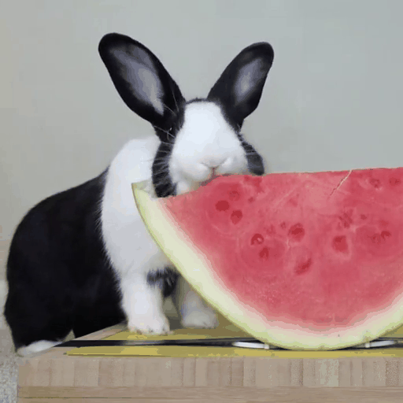

<div align="center">
  
# 🎥 Video Editing Using HunyuanVideo

</div>


# 🛠️ Code Setup
The environment of the code for video editing is the same as HunyuanVideo, you can refer to the [official repo](https://github.com/Tencent/HunyuanVideo) of HunyuanVideo, or running the following command to construct the environment.
```
conda env create -f environment.yml
conda activate RF-Solver-VideoEdit
python -m pip install -r requirements.txt
python -m pip install git+https://github.com/Dao-AILab/flash-attention.git@v2.5.9.post1
```
# 🚀 Examples for Video Editing
We have provided several examples to do the editing. We suggest to run the experiment on a single A100 GPU. (More examples will be released in the future!)


<table class="center">
<tr>
  <td width=10% align="center">Source image</td>
  <td width=30% align="center"></td>
  <td width=30% align="center"></td>
  <td width=30% align="center"></td>
</tr>
<tr>
  <td width="10%" align="center">Editing Scripts</td>
  <td width="30%" align="center"><a href="scripts/run_rabbit.sh">Rabbit -> Cat</a></td>
  <td width="30%" align="center"><a href="scripts/run_jeep.sh">Jeep -> Pink Porsche</a></td>
  <td width="30%" align="center"><a href="scripts/run_panda.sh">+ Crown</a></td>
</tr>
<tr>
  <td width=10% align="center">Edtied image</td>
  <td width=30% align="center"></td>
  <td width=30% align="center"></td>
  <td width=30% align="center"></td>
</tr>

</table>


# 🪄 Edit Your Own Video

You can also run the following scripts to edit your own video. 
```
python3 edit_video.py   \
        --source_path [Directory of your Source video] \
        --target_prompt [Describe your editing requirements]     \
        --infer-steps 25    \
        --source_prompt ""     \
        --flow-reverse     \
        --use-cpu-offload    \
        --save-path [Directory to save the edited video] \
        --inject_step [typically set to a number between 1 to 5] \
        --embedded-cfg-scale [typically set to a number between 1 to 6] 
```
In the above scripts, the ```--inject_step``` refers to the steps of feature sharing in RF-Edit, which is highly related to the performance of editing. We suggest to adjust the hyper-parameters of ```--inject_step``` and ```--embedded-cfg-scale``` to achieve best results.


# 🖋️ Citation

If you find our work helpful, please **star 🌟** this repo and **cite 📑** our paper. Thanks for your support!

```
@article{wang2024taming,
  title={Taming Rectified Flow for Inversion and Editing},
  author={Wang, Jiangshan and Pu, Junfu and Qi, Zhongang and Guo, Jiayi and Ma, Yue and Huang, Nisha and Chen, Yuxin and Li, Xiu and Shan, Ying},
  journal={arXiv preprint arXiv:2411.04746},
  year={2024}
}
```

