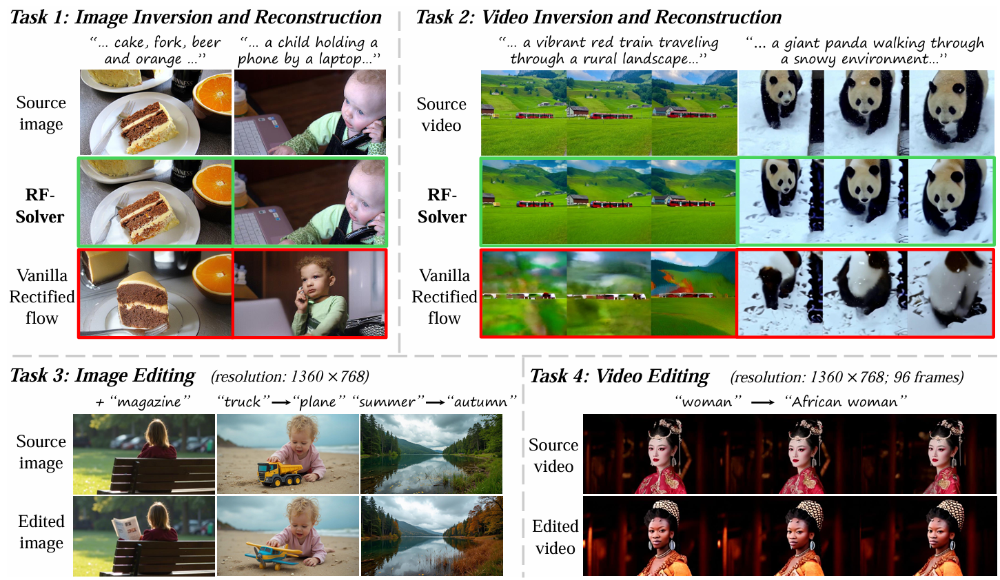
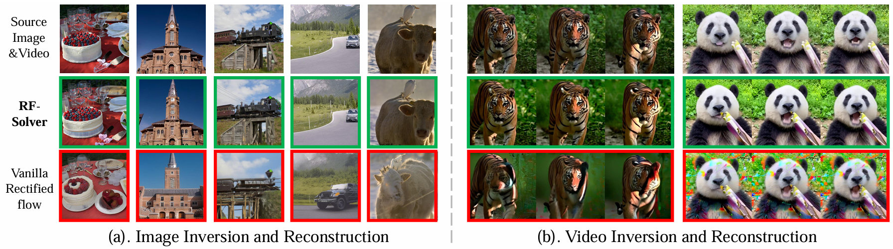
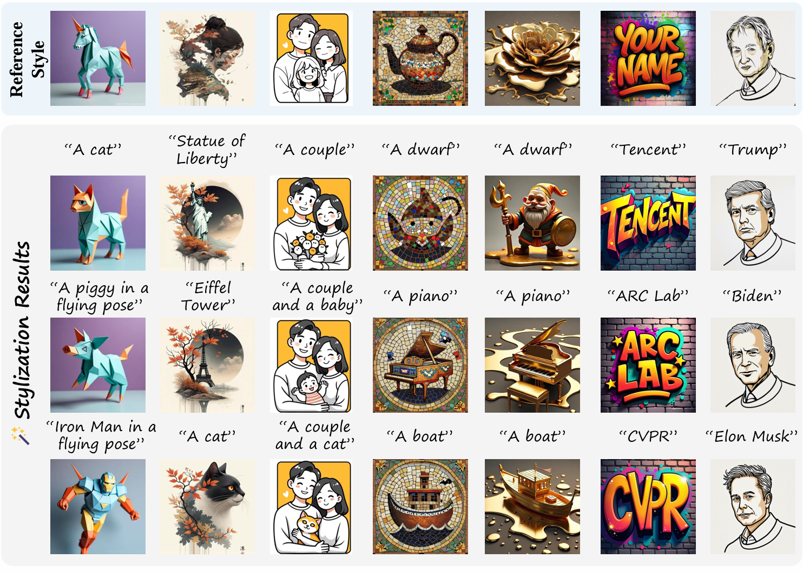
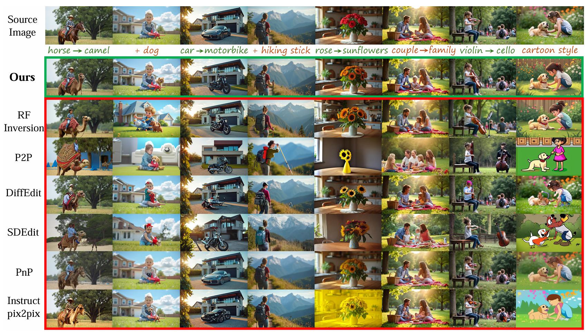
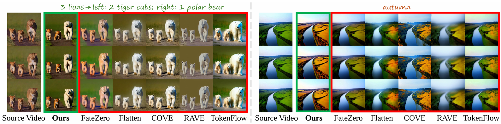

<div align="center">
  
# Taming Rectified Flow for Inversion and Editing

[Jiangshan Wang](https://scholar.google.com/citations?user=HoKoCv0AAAAJ&hl=en)<sup>1,2</sup>, [Junfu Pu](https://pujunfu.github.io/)<sup>2</sup>, [Zhongang Qi](https://scholar.google.com/citations?hl=en&user=zJvrrusAAAAJ&view_op=list_works&sortby=pubdate)<sup>2</sup>, [Jiayi Guo](https://www.jiayiguo.net)<sup>1</sup>, [Yue Ma](https://mayuelala.github.io/)<sup>3</sup>, <br> [Nisha Huang](https://scholar.google.com/citations?user=wTmPkSsAAAAJ&hl=en)<sup>1</sup>, [Yuxin Chen](https://scholar.google.com/citations?hl=en&user=dEm4OKAAAAAJ)<sup>2</sup>, [Xiu Li](https://scholar.google.com/citations?user=Xrh1OIUAAAAJ&hl=en&oi=ao)<sup>1</sup>, [Ying Shan](https://scholar.google.com/citations?hl=en&user=4oXBp9UAAAAJ&view_op=list_works&sortby=pubdate)<sup>2</sup>

<sup>1</sup> Tsinghua University,  <sup>2</sup> Tencent ARC Lab,  <sup>3</sup> HKUST  

[](https://arxiv.org/abs/2411.04746)
<a href='https://rf-solver-edit.github.io/'></a>
[](https://huggingface.co/spaces/wjs0725/RF-Solver-Edit) 
[](https://github.com/logtd/ComfyUI-Fluxtapoz) 
</div>


<p>
We propose <strong>RF-Solver</strong> to solve the rectified flow ODE with less error, thus enhancing both sampling quality and inversion-reconstruction accuracy for rectified-flow-based generative models. Furthermore, we propose <strong>RF-Edit</strong> to leverage the <strong>RF-Solver</strong> for image and video editing tasks. Our methods achieve impressive performance on various tasks, including text-to-image generation, image/video inversion, and image/video editing. 
</p>


<p align="center">

</p>

# 🔥 News
- **[2025.3.24]** 🔥We have implemented our methods on [HunyuanVideo](https://github.com/Tencent/HunyuanVideo) and released the code!
- [2024.11.30] Our demo is available on 🤗 [Huggingface Space](https://huggingface.co/spaces/wjs0725/RF-Solver-Edit)!
- [2024.11.24] Thanks @[logtd](https://github.com/logtd) for implementing RF-Solver in [LTX-Video](https://github.com/logtd/ComfyUI-LTXTricks)!
- [2024.11.18] More examples for style transfer are available!
- [2024.11.18] Gradio Demo for image editing is available!
- [2024.11.16] Thanks @[logtd](https://github.com/logtd) for integrating RF-Solver into [ComfyUI](https://github.com/logtd/ComfyUI-Fluxtapoz)! 
- [2024.11.11] The [homepage](https://rf-solver-edit.github.io/) of the project is available!
- [2024.11.08] Code for image editing is released!
- [2024.11.08] Paper released!

# 👨‍💻 ToDo
- ☑️ Release the gradio demo
- ☑️ Release scripts for more image editing cases
- ☑️ Release the code for video editing


# 📖 Method
## RF-Solver
<p>

We derive the exact formulation of the solution for Rectified Flow ODE. The non-linear part in this solution is processed by Taylor Expansion. Through higher order expansion, the approximation error in the solution is significantly reduced, thus achieving impressive performance on both text-to-image sampling and image/video inversion.
</p>

## RF-Edit
<p>

Based on RF-Solver, we further propose the RF-Edit for image and video editing. RF-Edit framework leverages the features from inversion in the denoising process, which enables high-quality editing while preserving the structural information of source image/video. RF-Edit contains two sub-modules, especially for image editing and video editing.
</p>

# 🖼️ Image Editing


For image editing, RF-Edit employs FLUX as the backbone, which comprises several double blocks and single blocks. Double blocks independently modulate text and image features, while single blocks concatenate these features for unified modulation. In this architecture, RF-Edit shares features within the single blocks, as they capture information from both the source image and the source prompt, enhancing the ability of the model to preserve the structural information of the source image.

<strong>😁 We have provided the code and demo for image editing using FLUX as the backbone, which can be found <a href="./FLUX_Image_Edit">Here</a>.</strong>

# 🎥 Video Editing

For video editing, in our paper, we employ OpenSora as the backbone. The DiT blocks in OpenSora include spatial attention, temporal attention, and text cross-attention. Within this architecture, the structural information of the source video is captured in the spatial attention module, where we implement feature sharing.

Note that the more powerful video generation model HunyuanVideo is released recently, which is also a RF-based method. The code for video editing in this Repo is implemented based on HunyuanVideo.


<strong> 😁 We have provided the code and demo for video editing using HunyuanVideo as the backbone, which can be found <a href="./Hunyuanvideo_Video_Edit">Here</a>.</strong>


# 🎨 Gallery
## Inversion and Reconstruction  

<p align="center">

</p>

## Image Stylization

<p align="center">

</p>

## Image Editing

<p align="center">

</p>

## Video Editing

<p align="center">

</p>

# 🖋️ Citation

If you find our work helpful, please **star 🌟** this repo and **cite 📑** our paper. Thanks for your support!

```
@article{wang2024taming,
  title={Taming Rectified Flow for Inversion and Editing},
  author={Wang, Jiangshan and Pu, Junfu and Qi, Zhongang and Guo, Jiayi and Ma, Yue and Huang, Nisha and Chen, Yuxin and Li, Xiu and Shan, Ying},
  journal={arXiv preprint arXiv:2411.04746},
  year={2024}
}
```

# Acknowledgements
We thank [FLUX](https://github.com/black-forest-labs/flux/tree/main) and [HunyuanVideo](https://github.com/Tencent/HunyuanVideo) for their clean codebase.

# Contact
The code in this repository is still being reorganized. Errors that may arise during the organizing process could lead to code malfunctions or discrepancies from the original research results. If you have any questions or concerns, please send emails to wjs23@mails.tsinghua.edu.cn.
